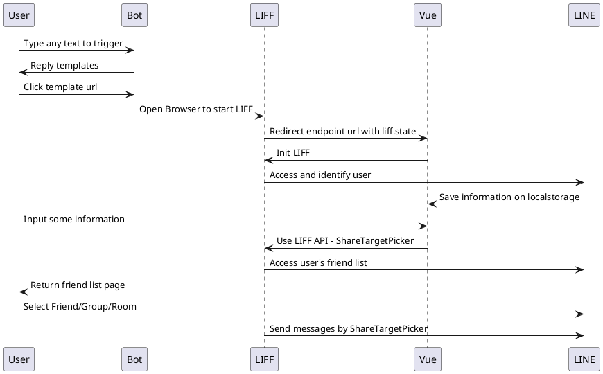

---
title:
  "[object Object]": null
categories: 學習紀錄
tags:
---


# 前言

<!-- more -->

# 流程



# 初期規劃

- Backend:
  - Bot: admin interface to select template
  - API: catch browser request and use EJS to response frontend for browser
  - EJS: use LIFF to send Flex Message

使用 Express + EJS 來簡易使用 LIFF 發送 FlexMessage，完成第一版

詳細檔案可以看 Announcer 的 [Release tag](https://github.com/louis70109/Announcer/tree/v1-ejs)

若是用後端驅動驅動前端頁面的話就會需要一個跳轉的頁面來幫忙重新導向


且你的後端需要一個 if 判斷式來判斷當前 Query String 是否含有 `liff.state` 的參數並導向至跳轉頁面上，若後端是用 python 的開發者則可以使用 decorator 來處理這部分。

```javascript
app.get("/liff/template", (req: Request, res: Response) => {
  if (req.query["liff.state"]) {
    res.render("redirect", {
      liffId: CONCAT_ID,
    });
  }
});
```

其他部分則只需要根據需求去增加頁面 & API 路由即可。

雖然簡單堪用，但在前端畫面中沒辦法很快速的去增加我要相關渲染操作，也因為以前就有寫過 Vue 的相關經驗知道可以更快速地實現，因此我就著手開始 survey [Vue composition API](https://composition-api.vuejs.org/api.html) 相關的使用方法，在使用 Composition API 的感覺上真的不錯，用起來感覺可以引用 Kuro 008 Javascript 書裡面的一句話：「最小單位是 Function」，操作上有任何需求只要用`最小單位`(Function)去開發就可以很順手，在 Return 時 Vue 就會自動地依照個別的定義去做使用

```javascript
// Example
<template>
  <div>{{ count }} {{ object.foo }}</div>
</template>

<script>
  import { ref, reactive } from 'vue'

  export default {
    setup() {
      const count = ref(0)
      const object = reactive({ foo: 'bar' })

      // expose to template
      return {
        count,
        object
      }
    }
  }
</script>
```

由於 template 增加開始需要一些渲染的作業，寫純 JS 除了 code 會變很多以外也在重複造輪子，由於框架已經幫忙做好很多這類的事情，因此就將它轉至框架上

> 關於如何在 Vue 中引入 LIFF 可以參考[這篇文章](https://nijialin.com/2020/09/12/how-to-use-liff-in-vue3/)

已分離的 [Backend 版本](https://github.com/louis70109/Announcer/tree/v1.0.0)

# 介紹

# 結論

# 活動小結

立即加入「LINE 開發者官方社群」官方帳號，就能收到第一手 Meetup 活動，或與開發者計畫有關的最新消息的推播通知。▼

「LINE 開發者官方社群」官方帳號 ID：@line_tw_dev


# 關於「LINE 開發社群計畫」

LINE 今年年初在台灣啟動「LINE 開發社群計畫」，將長期投入人力與資源在台灣舉辦對內對外、線上線下的開發者社群聚會、徵才日、開發者大會等，已經舉辦 30 場以上的活動。歡迎讀者們能夠持續回來察看最新的狀況。詳情請看:

- [2019 年 LINE 開發社群計畫活動時程表](https://engineering.linecorp.com/zh-hant/blog/line-taiwan-developer-relations-2019-plan/)
- [LINE Taiwan Developer Relations 2019 回顧與 2019 開發社群計畫報告](https://engineering.linecorp.com/zh-hant/blog/line-taiwan-developer-relations-2019/)
- [2020 年 LINE 開發社群計畫活動時程表](https://engineering.linecorp.com/zh-hant/blog/2020-line-tw-devrel/)
