# 前言

<!-- more -->

# 介紹


## 📊 Rich menu 更新


> [官方 API 更新新聞](https://developers.line.biz/en/news/2022/05/13/richmenu-keyboard/)

Rich Menu 在與官方帳號互動時很方便，不過過去在使用上會遇到一些小問題，在如今已經有方法解決囉！讓我們繼續往下看。


### 過去遇到 或 無法處理的問題

- 從 Rich Menu 按下按鈕後送出 Flex Message 後，如果訊息量太長，上面的內容會看不到
- 只能手動縮小 Rich Menu
- 切換鍵盤步驟過多
  - 高互動的官方帳號不好處理(例如: 遊戲型OA)

### 現在能怎麼做?

在這次更新中支援了以下四種功能:

- closeRichMenu: 關閉 rich menu
- openRichMenu: 打開 rich menu
- openKeyboard: 打開鍵盤
- openVoice: 打開 voice message 的輸入模式


除了透過 [postback action](https://developers.line.biz/en/reference/messaging-api/#postback-action) 打開以上四種 actions，另外還可以在打開鍵盤同時，輸入文字，並且可以帶有 `\n`，最多 300 字

範例:
```json
{
  "type": "postback",
  "label": "Buy",
  "data": "action=buy&itemid=123",
  "displayText": "Buy",
  "inputOption": "openKeyboard",
  "fillInText": "---\nName: \nPhone: \nBirthday: \n---"
}
```

如此一來解決了透過 Rich Menu 發送 Flex Message 版面看不清楚、切換鍵盤、自動輸入文字等等的問題，讓大家在開發 Chatbot 時可以有更好的使用者體驗！

> API Expert - 均民 詳細寫了一篇文章，歡迎大家參考: [新功能：在官方帳號開關選單、切換文字或語音輸入](https://taichunmin.idv.tw/blog/2022-05-14-line-postback-input-option.html)


## 🌏LIFF 更新

最近 LIFF 團隊釋出了讓大家可以快速建立 web app 的工具，支援了各大主流框架，且使用方式相當容易。並且也提供了去年 DevDay 提到的兩個 plugin，以下就帶大家看一下！

> 參考[最近的新聞](https://developers.line.biz/en/docs/liff/cli-tool-create-liff-app/#advance-preparation)

### 透過 npx 初始化一個 LIFF app
```
$ npx @line/create-liff-app
```


### 選擇想用的框架與相關參數


- 名稱
- 框架
- 型別
  - JavaScript/TypeScript
- LIFF ID
  - 會在 `.env` 中，還沒填後續可以改
- 套件管理？ yarn || npm


### [LIFF Inspector/Mock](https://developers.line.biz/en/news/2022/04/25/liff-plugin/)

各位開發者不管在開發何種網頁上的內容，最需要的就是透過 DevTools 去檢查是否有元素跑掉，或是相關邏輯印出來的資訊是否有符合預期。過去在開發 LIFF 時會遇到的問題就是，在手機端測試開發項目時，除了用 alert() 暴力破解之外，就是 vConsole 來協助開發時顯示一些 log 方便除錯。

而在如今 LIFF 團隊出了全新的 plugin - Inspector，協助大家在手機/桌機開發 LIFF app 時，可以讓相關的訊息透過 websocket 的方式到 PC 瀏覽器的 DevTools 中顯示，如此一來就可以在開發上有更好的體驗。


另一方面的 plugin，Mock 是許多開發 LIFF 的前端開發者很大的福音，畢竟 LIFF 有一部份還是依靠 LINE Server 上的交握才可以讓大家獲取一些應用程式中的行為，在這邊透過 Mock 就可以測試流程中把 LIFF 給擋住，預設他的行為會是正確的，進而達到測試的目的性。

## 🚀 [Flex Message Update 3](https://developers.line.biz/en/news/2022/03/11/flex-message-update-3-released/)

- video 可展示在 hero 區塊 🚀
- 在 box component 中指定寬、高最大值
- text component 可加上行距(line spacing)
- [Flex Message Simulator](https://developers.line.biz/flex-simulator/) 支援 Update 3

影片功能是我在早期開發 Flex Message 時就很期待的功能之一，如今終於可以使用啦！並且搭配在上一版中已可以放上 APNG 來展示動圖，如此一來整個 Flex 就可以更加的完整使用，搭配更多的英用來操作。

> 文章可以參考： [如何透過 LINE Video Flex Message 來打造影片翻譯（自動輸出文字）LINE Bot 聊天機器人](https://engineering.linecorp.com/zh-hant/blog/line-video-flex-message-bot/)
## 📝 [Webhook redelivery](https://developers.line.biz/en/news/2022/03/07/pre-release-webhook-redelivery/)

過去可能在某次上版之後，開發者自己寫的 Chatbot(Backend API) 忽然壞掉，導致 chatbot 在收到訊息轉打到 webhook 時完全沒反應，更前端的用戶卻不知道發生什麼事，即便再後來修好了，當時用戶的需求沒辦法被滿足，這樣子的體驗就會變得不太好。(如下)

```puml
@startuml

User->Chatbot: 發送訊息
Chatbot->User: 已讀，資訊處理中
Chatbot->LINE: LINE Server 收到資訊
LINE->Chatbot: 已收到，轉至 webhook
LINE->Backend: 透過 webhook 打到 Backend API
Backend->LINE: 200 OK
note over LINE, Backend #ADFF2F: 一般回傳成功


LINE->Backend: 透過 webhook 打到 Backend API
Backend->LINE: 400 || 500... LINE Server 找不到

note over LINE, Backend #FA8072: 失敗回傳後，用戶不知道發生什麼事

User<-->LINE: 怎麼沒有回應呢???
@enduml
```



在這次有了 Webhook redelivery 之後，可以在 LINE Developer Console 中去設定按鈕。


設定完了之後，在請求失敗後 LINE Server 也會在一定的時間內持續打訊息到 webhook url 中，讓暫時故障的 Server 可以在修復後收到請求，讓用戶後續還可以收到回饋，避免用戶流失的問題。

### Check error statistics for sending webhooks

一般來說會開啟 redelivery，就是預計會有失敗的呼叫產生，因此在這也會一起把這些歷程也給記錄下來，因此這邊打開之後可以看到被呼叫的錯誤狀態，進而搭配 Server log 去追朔到狀態發生當下的問題，協助大家可以更釐清是否有邏輯上的問題產生。

# 結論

# 活動小結

立即加入「LINE 開發者官方社群」官方帳號，就能收到第一手 Meetup 活動，或與開發者計畫有關的最新消息的推播通知。▼

「LINE 開發者官方社群」官方帳號 ID：@line_tw_dev


# 關於「LINE 開發社群計畫」

LINE 今年年初在台灣啟動「LINE 開發社群計畫」，將長期投入人力與資源在台灣舉辦對內對外、線上線下的開發者社群聚會、徵才日、開發者大會等，已經舉辦 30 場以上的活動。歡迎讀者們能夠持續回來察看最新的狀況。詳情請看:

- [2019 年 LINE 開發社群計畫活動時程表](https://engineering.linecorp.com/zh-hant/blog/line-taiwan-developer-relations-2019-plan/)
- [LINE Taiwan Developer Relations 2019 回顧與 2019 開發社群計畫報告](https://engineering.linecorp.com/zh-hant/blog/line-taiwan-developer-relations-2019/)
- [2020 年 LINE 開發社群計畫活動時程表](https://engineering.linecorp.com/zh-hant/blog/2020-line-tw-devrel/)
- [2021 年 LINE 開發社群計畫活動時程表 (持續更新)](https://engineering.linecorp.com/zh-hant/blog/2021-line-tw-devrel/)

<style>
  section.compact {
    font-size: 150%  
  }
  img[alt~="center"] {
    display: block;
    margin: 0 auto;
  }
</style>
