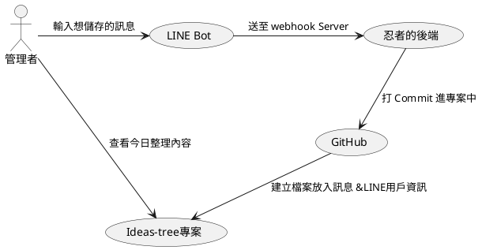

<iframe class="speakerdeck-iframe" frameborder="0" src="https://speakerdeck.com/player/9f9e836869da46879b027b8750fe43d1?slide=1" title="Life Hacker with LINE Bot and GitHub API" allowfullscreen="true" mozallowfullscreen="true" webkitallowfullscreen="true" style="border: 0px; background: padding-box padding-box rgba(0, 0, 0, 0.1); margin: 0px; padding: 0px; border-radius: 6px; box-shadow: rgba(0, 0, 0, 0.2) 0px 5px 40px; width: 560px; height: 314px;" data-ratio="1.78343949044586"></iframe>

# 前言

- [簡報連結](https://speakerdeck.com/line_developers_tw/life-hacker-with-line-bot-and-github-api)
<!-- more -->

# 為什麼誕生這篇文章(分享)?

<iframe class="speakerdeck-iframe" frameborder="0" src="https://speakerdeck.com/player/9f9e836869da46879b027b8750fe43d1?slide=3" title="Life Hacker with LINE Bot and GitHub API" allowfullscreen="true" mozallowfullscreen="true" webkitallowfullscreen="true" style="border: 0px; background: padding-box padding-box rgba(0, 0, 0, 0.1); margin: 0px; padding: 0px; border-radius: 6px; box-shadow: rgba(0, 0, 0, 0.2) 0px 5px 40px; width: 560px; height: 314px;" data-ratio="1.78343949044586"></iframe>

- 訊息散落在個人群組、各種聊天室
- 「那個OOO網址借我放一下」，應該很常看到這句話?
- 平常喜歡看 GitHub
- 許多工作訊息、聊天內容都在 LINE 上面

> 因為上述原因誕生了這次的想法

# Part 1. 整合 GitHub API + LINE Bot

<iframe class="speakerdeck-iframe" frameborder="0" src="https://speakerdeck.com/player/9f9e836869da46879b027b8750fe43d1?slide=5" title="Life Hacker with LINE Bot and GitHub API" allowfullscreen="true" mozallowfullscreen="true" webkitallowfullscreen="true" style="border: 0px; background: padding-box padding-box rgba(0, 0, 0, 0.1); margin: 0px; padding: 0px; border-radius: 6px; box-shadow: rgba(0, 0, 0, 0.2) 0px 5px 40px; width: 560px; height: 314px;" data-ratio="1.78343949044586"></iframe>

首先我建立了一個專案叫做 [ideas-tree](https://github.com/louis70109/ideas-tree) 準備來放我日常收集的小點子，接著另外建立一個 [LINE Bot 專案](https://github.com/louis70109/line-bot-gitbub-actions-receiver)，專門來處理管理者(我)與 LINE Bot 放上的任何點子訊息。

<iframe class="speakerdeck-iframe" frameborder="0" src="https://speakerdeck.com/player/9f9e836869da46879b027b8750fe43d1?slide=6" title="Life Hacker with LINE Bot and GitHub API" allowfullscreen="true" mozallowfullscreen="true" webkitallowfullscreen="true" style="border: 0px; background: padding-box padding-box rgba(0, 0, 0, 0.1); margin: 0px; padding: 0px; border-radius: 6px; box-shadow: rgba(0, 0, 0, 0.2) 0px 5px 40px; width: 560px; height: 314px;" data-ratio="1.78343949044586"></iframe>

把服務叫起來之後於聊天室內打上訊息，即可把輸入的內容打到 [ideas-tree](https://github.com/louis70109/ideas-tree) 上面做紀錄，在這些過程中的流程請參考以下流程圖。

# 結論

# 活動小結

立即加入「LINE 開發者官方社群」官方帳號，就能收到第一手 Meetup 活動，或與開發者計畫有關的最新消息的推播通知。▼

「LINE 開發者官方社群」官方帳號 ID：@line_tw_dev

# 關於「LINE 開發社群計畫」

LINE 於 2019 年開始在台灣啟動「LINE 開發社群計畫」，將長期投入人力與資源在台灣舉辦對內對外、線上線下的開發者社群聚會、徵才日、開發者大會等，已經舉辦 30 場以上的活動。歡迎讀者們能夠持續回來查看最新的狀況。詳情請看:

- [2021 年 LINE 開發社群計畫活動時程表](https://engineering.linecorp.com/zh-hant/blog/2021-line-tw-devrel/)
- [2020 年 LINE 開發社群計畫活動時程表](https://engineering.linecorp.com/zh-hant/blog/2020-line-tw-devrel/)
- [2019 年 LINE 開發社群計畫活動時程表](https://engineering.linecorp.com/zh-hant/blog/line-taiwan-developer-relations-2019-plan/)
- [LINE Taiwan Developer Relations 2019 回顧與 2019 開發社群計畫報告](https://engineering.linecorp.com/zh-hant/blog/line-taiwan-developer-relations-2019/)

