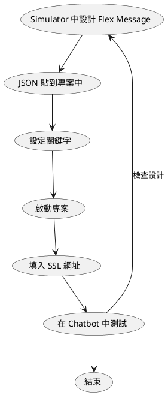

# 前言

<!-- more -->

# [Flex Message](https://developers.line.biz/en/docs/messaging-api/using-flex-messages/) 簡介

Flex Message 是什麼？它是一個 LINE 很強大的訊息圖文選單，能夠讓開發者透過 JSON 的方式建立起漂亮的選單(如下)，讓 LINE 官方帳號(Official Account)的擁有者(Provider)可以使用設計過的訊息選單與用戶做更多的互動。

當中的許多設計概念與 CSS 的 [Flex Box](https://developer.mozilla.org/zh-TW/docs/Web/CSS/CSS_Flexible_Box_Layout/Basic_Concepts_of_Flexbox) 相似，如果有開發過前端的朋友也歡迎來試試看 LINE 的 Flex Message。

延伸閱讀：

- [使用 2020 Flex Message 的 10 個新功能 – 讓您在 LINE 的訊息設計更有彈性](https://engineering.linecorp.com/zh-hant/blog/2020-flex-message-10-reason/)
- [在 Vue3 中引入 LIFF 的 ShareTargetPicker 分享 FlexMessage 訊息給 LINE 好友](https://engineering.linecorp.com/zh-hant/blog/how-to-use-liff-in-vue3/)
- [Flex Message 的 Update 1 已公開](https://engineering.linecorp.com/zh-hant/blog/flex-message-update1/)
- [2020/10 Flex Message Update 2 released](https://developers.line.biz/en/news/2020/10/08/flex-message-update-2-released/)

# 如何設計與測試 Flex Message？使用 LINE Simulator

許多開發者在開發 Flex Message 給 Chatbot 或是 ShareTargetPicker ([參考文章](https://engineering.linecorp.com/zh-hant/blog/share-target-picker-liff/))時經常會透過 [LINE Simulator](https://developers.line.biz/flex-simulator) 來將想要的訊息格式透過介面上的操作選項來處理想發送在 LINE 平台上的內容，如下圖所示，為一開始進入 Simulator 頁面的初始狀態。

相信有在開發 Chatbot 的朋友對這個功能鐵定不陌生，而今天要介紹的部分則是近期在[官方新聞稿](https://developers.line.biz/en/news/2021/05/20/send-test-message-flex-message-simulator/)中釋出在介面上的新功能 - **發送測試訊息**，那這個功能有什麼特別？以及他解決了什麼問題呢？以下說明一個之前開發的範例流程：

光是在過程中

- 官方文件： [Using Flex Message Simulator to create a digital business card](https://developers.line.biz/en/docs/messaging-api/using-flex-message-simulator/)

對戰範例一：

疊層範例：

# 結論

# 活動小結

立即加入「LINE 開發者官方社群」官方帳號，就能收到第一手 Meetup 活動，或與開發者計畫有關的最新消息的推播通知。▼

「LINE 開發者官方社群」官方帳號 ID：@line_tw_dev

# 關於「LINE 開發社群計畫」

LINE 今年年初在台灣啟動「LINE 開發社群計畫」，將長期投入人力與資源在台灣舉辦對內對外、線上線下的開發者社群聚會、徵才日、開發者大會等，已經舉辦 30 場以上的活動。歡迎讀者們能夠持續回來察看最新的狀況。詳情請看:

- [2019 年 LINE 開發社群計畫活動時程表](https://engineering.linecorp.com/zh-hant/blog/line-taiwan-developer-relations-2019-plan/)
- [LINE Taiwan Developer Relations 2019 回顧與 2019 開發社群計畫報告](https://engineering.linecorp.com/zh-hant/blog/line-taiwan-developer-relations-2019/)
- [2020 年 LINE 開發社群計畫活動時程表](https://engineering.linecorp.com/zh-hant/blog/2020-line-tw-devrel/)
- [2021 年 LINE 開發社群計畫活動時程表 (持續更新)](https://engineering.linecorp.com/zh-hant/blog/2021-line-tw-devrel/)
