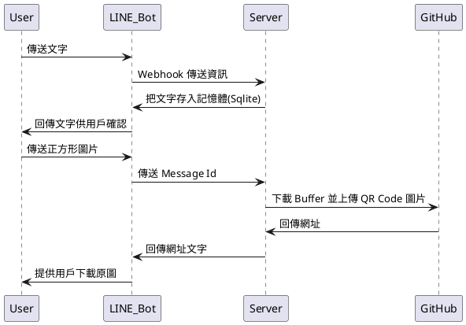

# 前言

延續上一篇「[幫 QR Code 加上背景圖，別只留下黑白！](https://nijialin.com/2023/02/05/nodejs-custom-qrcode-background/)」，因為只需要一個輸入框輸入網址、以及上傳一張圖片，想了想感覺就很適合透過 LINE Bot 來幫忙產生，以下就來跟大家介紹一下這次開發時的一些註解～

> NodeJS repository: https://github.com/louis70109/qrcode-background-generator

<!-- more -->

# 介紹

## 為什麼用 LINE Bot?

對我來說，因為我時常會手機跟電腦頻繁切換，因此即便在電腦上有存在書籤，但在手機上則可能會弄丟網址，而做成 Bot 就不容易弄丟，只要打開 LINE 即可。

因為這次的`流程`只需要兩步驟，因此就不用勞煩前端或 LIFF，也讓我這後端工程師少寫點不熟悉的 HTML ... XD

### 圖片存哪好？

我自己是透過 GitHub 的方式來儲存圖片(畢竟公有雲之類的放太多還是會需要儲存費)，詳細可參考「[在 GCS || GitHub 上傳圖片並取得網址](https://nijialin.com/2022/10/02/upload-image-get-url-ways/)」。

> https://raw.githubusercontent.com/帳號/專案/master/檔案.png

但若串接 LINE Bot 上放入該檔案連結，在桌機版(v7.13)上目前會顯示不出來，但手機顯示的出來，但考量下載傳輸過程是會`壓縮圖片`(增加性能)，因此在實作上還是以傳連結的方式，讓使用者可以抓到原檔的大小，不會被平台壓縮。

# 結論

# 活動小結

立即加入「LINE 開發者官方社群」官方帳號，就能收到第一手 Meetup 活動，或與開發者計畫有關的最新消息的推播通知。▼

「LINE 開發者官方社群」官方帳號 ID：[@line_tw_dev](https://qr-official.line.me/gs/M_908lugfe_BW.png)

# 關於「LINE 開發社群計畫」

LINE 於 2019 年開始在台灣啟動「LINE 開發社群計畫」，將長期投入人力與資源在台灣舉辦對內對外、線上線下的開發者社群聚會、徵才日、開發者大會等，已經舉辦 30 場以上的活動。歡迎讀者們能夠持續回來查看最新的狀況。詳情請看:

- [2021 年 LINE 開發社群計畫活動時程表](https://engineering.linecorp.com/zh-hant/blog/2021-line-tw-devrel/)
- [2020 年 LINE 開發社群計畫活動時程表](https://engineering.linecorp.com/zh-hant/blog/2020-line-tw-devrel/)
- [2019 年 LINE 開發社群計畫活動時程表](https://engineering.linecorp.com/zh-hant/blog/line-taiwan-developer-relations-2019-plan/)
- [LINE Taiwan Developer Relations 2019 回顧與 2019 開發社群計畫報告](https://engineering.linecorp.com/zh-hant/blog/line-taiwan-developer-relations-2019/)

