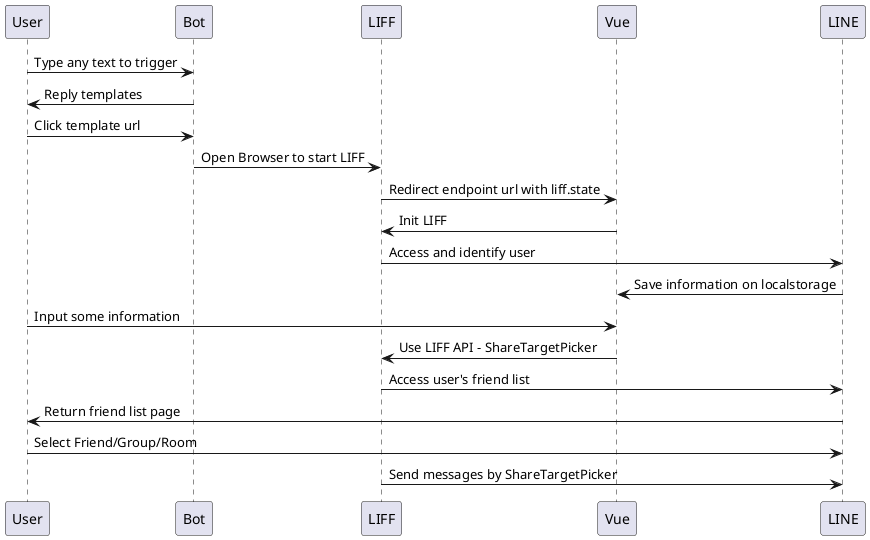

# 他怎麼出現的？

當時因為**公司**、**社群**、**工作坊**以及**各種朋友群組**都會需要分享各種活動資訊，包括活動告知、訂位消息、個人資訊卡、新聞...而每個需求中都剛好包含著其他功能 🔧，有時用 JavaScript、有時 Python，而每次寫的 Flex Message 就會散落在各地，東西、時間一多都會忘了當時做的東西在哪 💦，也就浪費當時花費的精力，而且在微服務這麼盛行的現今怎能不切出來呢 🤔


<!-- more -->

# 為什麼需要特別獨立 API？

如果你也是喜歡做 LINE Bot，或是經常拿來做許多的 Demo(簡易使用者介面展示、各種 API 溝通技巧...)，那你會很需要架設獨立一個 API。

- [Share Target Picker](https://developers.line.biz/en/reference/liff/#share-target-picker)
  - 分享給各種群組
- 提供給其他性質 Side Project 使用 Flex Message

> 專案位置 [louis70109/Announcer](https://github.com/louis70109/Announcer)


# 專案介紹

## 環境變數

```
NODE_ENV=develop
CONCAT_ID=
CHANNEL_ACCESS_TOKEN=
CHANNEL_SECRET=
GA=
FRONTEND_DOMAIN=
```

- `NODE_ENV`: 開發環境會引入 `.env` 檔案，預設為 **develop**
  - `if (process.env.NODE_ENV === 'develop') require('dotenv').config()`
- `CONCAT_ID`: 如果有使用 LIFF 的 [ShareTargetPicker](https://developers.line.biz/en/reference/liff/#share-target-picker) 分享，會把 LIFF 參數都放在此專案中
- `CHANNEL_ACCESS_TOKEN`: 如稍早看到的 LINE Bot 顯示畫面，讓管理者(我)可以透過 LINE Bot 來分享訊息
- `CHANNEL_SECRET`: 如上
- `GA`: 發 Flex Message 都有偷塞一個透明圖片

# 使用地方

之前有個前端搭配(當然現在還在)，



# 介紹

# 結論
